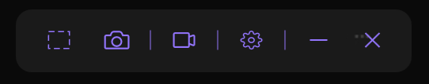
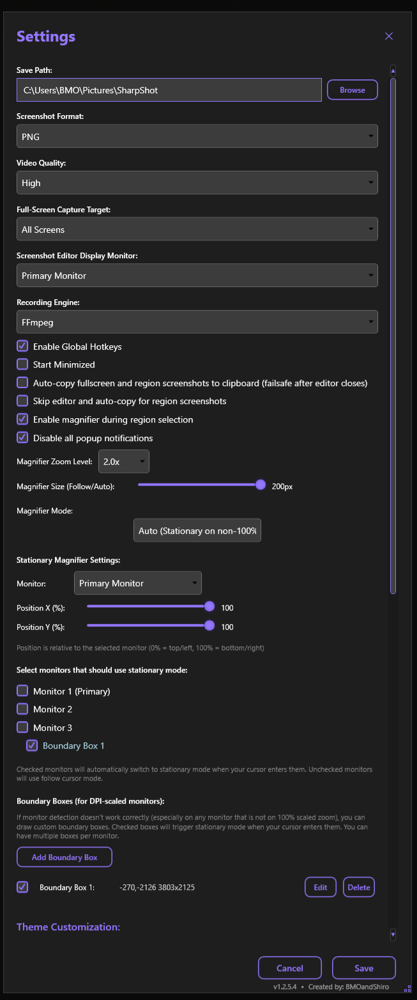
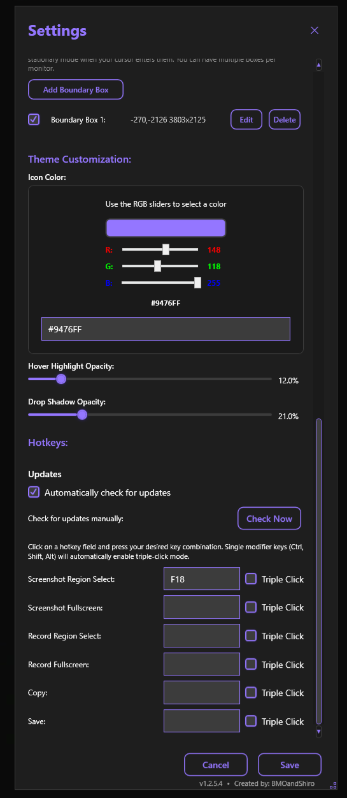
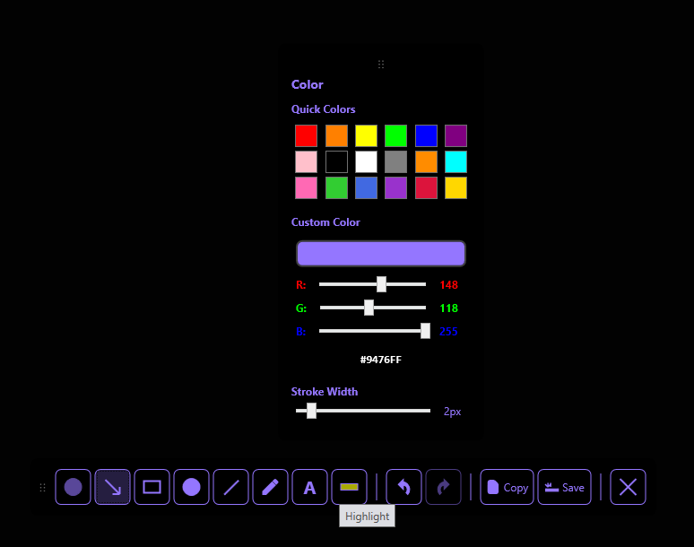
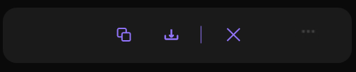

# SharpShot - Portable Screenshot & Screen Recording Tool

A modern, dark-themed screenshot and screen recording tool built with C# and WPF for Windows. **Fully portable - no installation required!**

  

## 🚀 Portability

**SharpShot is a fully portable application** - it requires **no installation** and can run directly from any folder, including USB drives or network locations.

### How Portability Works

- **Self-Contained**: The application includes the .NET 8.0 runtime, so you don't need to install .NET separately
- **Single File**: Published as a single executable with all dependencies bundled
- **No Registry**: Settings are stored in `%APPDATA%\SharpShot\settings.json` (user-specific) or can be configured to use a local settings file
- **No Admin Rights**: Runs without administrator privileges
- **Portable Dependencies**: FFmpeg and OBS Studio are bundled in the distribution folder

### Running SharpShot

1. **Download** the release package (e.g., `SharpShot-with-OBS-Release.zip`)
2. **Extract** to any folder (desktop, USB drive, etc.)
3. **Run** `Run SharpShot.bat` or double-click `SharpShot.exe`
4. **Done!** The floating toolbar appears and you're ready to capture

You can move the entire folder anywhere on your system or to another Windows PC - it will work the same way.

## ✨ Features

### 🖼️ Screenshot Functionality

- **Full Screen Capture**: Capture entire screen or specific monitor with one click
- **Region Selection**: Click-and-drag to select specific areas with precision
- **Screenshot Editor**: Built-in editor with powerful annotation tools:
  - **Blur Tool**: Blur sensitive information
  - **Arrow Tool**: Point to specific areas
  - **Rectangle/Circle Tools**: Draw shapes and boxes
  - **Line Tool**: Draw straight lines
  - **Pen Tool**: Freehand drawing
  - **Text Tool**: Add text annotations with customizable font size
  - **Highlight Tool**: Highlight areas with adjustable opacity
  - **Undo/Redo**: Full undo/redo support for all edits
- **Multiple Formats**: Save as PNG, JPG, or BMP
- **Copy to Clipboard**: Instantly copy screenshots to clipboard
- **Auto-Copy Option**: Automatically copy screenshots after capture (optional)
- **Skip Editor Option**: Bypass editor and auto-copy for faster workflow

### 🎥 Screen Recording

- **Full Screen Recording**: Record entire screen or specific monitor
- **Region Recording**: Record specific screen areas
- **Multiple Recording Engines**:
  - **FFmpeg**: Built-in recording with system audio and microphone support
  - **OBS Studio**: Professional recording with bundled OBS Studio (full GUI access)
- **Audio Support**: 
  - System audio capture
  - Microphone input
  - Customizable audio device selection
- **Real-Time Timer**: Live recording duration display
- **Visual Indicators**: Recording button changes and shows timer when active
- **Video Quality**: High, Medium, Low quality options

### 🔍 Magnifier Tool

- **Follow Cursor Mode**: Magnifier follows your mouse cursor for precise region selection
- **Stationary Mode**: Fixed position magnifier on any monitor
- **Auto Mode**: Automatically switches between follow and stationary based on monitor
- **Boundary Boxes**: Define custom areas for DPI-scaled monitors that don't detect correctly
- **Customizable Settings**:
  - Zoom level (1.0x to 10.0x)
  - Size (adjustable for both follow and stationary modes)
  - Position (for stationary mode)
  - Monitor selection
- **Multi-Monitor Support**: Works seamlessly across multiple displays

### ⌨️ Global Hotkeys

- **Fully Customizable**: Assign any key combination to any action
- **Single Modifier Support**: Using only Ctrl, Shift, or Alt automatically enables triple-click mode
- **Available Actions**:
  - Screenshot Region Select
  - Screenshot Fullscreen
  - Record Region Select
  - Record Fullscreen
  - Copy (from editor)
  - Save (from editor)
- **Enable/Disable**: Toggle global hotkeys on or off

### 🎨 Theme Customization

- **Icon Color**: Customize the accent color using RGB sliders or hex code
- **Hover Highlight Opacity**: Adjust the opacity of button hover effects
- **Drop Shadow Opacity**: Control the glow effect on hover
- **Live Preview**: See changes in real-time as you adjust settings

### ⚙️ Comprehensive Settings

- **Save Path**: Choose where to save screenshots and recordings
- **Screenshot Format**: PNG, JPG, or BMP
- **Video Quality**: High, Medium, Low
- **Full-Screen Capture Target**: All Screens, Primary Monitor, or specific monitor
- **Screenshot Editor Display Monitor**: Choose which monitor shows the editor
- **Recording Engine**: FFmpeg or OBS Studio
- **Audio Devices**: Select input and output audio devices
- **Start Minimized**: Launch hidden in system tray
- **Auto-Copy**: Automatically copy screenshots to clipboard
- **Skip Editor**: Bypass editor for region screenshots
- **Magnifier Settings**: All magnifier options
- **Disable Popups**: Turn off all notification popups
- **Auto-Update**: Enable automatic update checks from GitHub

### 🔄 Auto-Update System

- **Automatic Checks**: Checks for updates once per day (configurable)
- **Manual Check**: Check for updates anytime from Settings
- **GitHub Integration**: Downloads updates from GitHub Releases
- **Settings Preservation**: Your settings are preserved during updates
- **Progress Tracking**: Shows download and installation progress

### 🎯 Advanced Features

- **Multi-Monitor Support**: Capture from any monitor or all monitors
- **DPI Scaling Support**: Works correctly on high-DPI displays
- **Boundary Boxes**: Define custom areas for monitors with non-standard DPI scaling
- **Non-Focus-Stealing**: Captures don't steal focus from other applications
- **Always-On-Top Toolbar**: Floating toolbar stays visible above other windows
- **Draggable Toolbar**: Move the toolbar anywhere on screen

## 📸 Screenshots

### Main Floating Toolbar

The always-on-top, draggable toolbar provides quick access to all core features:



*The floating toolbar with region selection, screenshot, recording, settings, minimize, and close buttons*

### Settings Window

#### General Settings


*General settings including save path, screenshot format, video quality, capture targets, and various behavior options*

#### Magnifier & Boundary Boxes



*Magnifier settings with zoom level, size controls, mode selection (Follow/Stationary/Auto), and boundary box configuration for DPI-scaled monitors*

#### Theme Customization & Hotkeys



*Theme customization with RGB color sliders, opacity controls, and hotkey configuration with update settings*

### Screenshot Editor

The built-in editor provides powerful annotation tools:



*Screenshot editor showing color picker with quick colors and RGB sliders, stroke width adjustment, and the annotation toolbar with blur, arrow, rectangle, circle, line, pen, text, and highlight tools*

### Post-Capture Options

After capturing a screenshot, you can quickly copy, save, or cancel:



*The post-capture toolbar with copy, save, and cancel options*

## 📦 Installation & Usage

### Option 1: Pre-built Portable Package (Recommended)

**Download the complete package:**
- `SharpShot-with-OBS-Release.zip` (includes bundled OBS Studio and FFmpeg)
- Extract to any folder
- Run `Run SharpShot.bat` or double-click `SharpShot.exe`

**No installation required!** The application is fully portable and can run from:
- Desktop
- USB drive
- Network location
- Any folder on your system

### Option 2: Build from Source

**Prerequisites:**
- Windows 10/11
- .NET 8.0 SDK
- PowerShell

**Build with bundled OBS:**
```powershell
# Clone the repository
git clone <repository-url>
cd SharpShot

# Run the build script (includes OBS bundling)
.\Build SharpShot with OBS.bat
```

**Manual build:**
```powershell
# Build with OBS bundling
powershell -ExecutionPolicy Bypass -File "build-with-obs.ps1"
```

### Option 3: Development Build

**Prerequisites:**
- Windows 10/11
- .NET 8.0 Runtime

**Building from Source:**
```bash
# Clone the repository
git clone <repository-url>
cd SharpShot

# Restore dependencies
dotnet restore

# Build the project
dotnet build

# Run the application
dotnet run
```

### Running the Application

1. **Launch**: Run `Run SharpShot.bat` or `SharpShot.exe`
2. **Toolbar**: A floating toolbar appears (draggable, always-on-top)
3. **Screenshot**: 
   - Click the region button (🔲) for region selection
   - Click the screenshot button (📸) for full screen
   - Or use your configured hotkeys
4. **Recording**: 
   - Click the recording button (🎥) to choose region or full screen
   - Select FFmpeg or OBS Studio
   - Use stop/pause buttons during recording
5. **Settings**: Click the settings button (⚙️) to configure options
6. **Close**: Click the close button (❌) to exit

## 📁 Project Structure

```
SharpShot/
├── App.xaml                 # Application entry point and resources
├── App.xaml.cs              # Application lifecycle management
├── MainWindow.xaml           # Main floating toolbar UI
├── MainWindow.xaml.cs        # Main window logic
├── Models/
│   └── Settings.cs           # Settings model with INotifyPropertyChanged
├── Services/
│   ├── SettingsService.cs    # Settings loading/saving
│   ├── ScreenshotService.cs  # Screenshot capture logic
│   ├── RecordingService.cs  # Screen recording logic
│   ├── OBSBundlingService.cs # OBS Studio integration
│   └── UpdateService.cs      # Auto-update system
├── Utils/
│   ├── HotkeyManager.cs      # Global hotkey management
│   └── OBSDetection.cs       # OBS Studio detection
└── UI/
    ├── SettingsWindow.xaml    # Settings dialog UI
    ├── SettingsWindow.xaml.cs # Settings dialog logic
    ├── RegionSelectionWindow.xaml # Region selection overlay
    ├── ScreenshotEditorWindow.xaml # Screenshot editor
    ├── MagnifierWindow.xaml   # Magnifier tool
    ├── CaptureResultWindow.xaml # Capture result display
    └── UpdateWindow.xaml      # Update notification window
```

## ⚙️ Configuration

### Settings Location

Settings are automatically saved to:
```
%APPDATA%\SharpShot\settings.json
```

### Default Settings

- **Save Path**: `%USERPROFILE%\Pictures\SharpShot`
- **Screenshot Format**: PNG
- **Video Quality**: High
- **Recording Engine**: FFmpeg
- **Audio Recording**: No Audio (user can enable)
- **Global Hotkeys**: Disabled (user can enable)
- **Start Minimized**: Disabled
- **Magnifier**: Enabled, 2.0x zoom, Follow cursor mode
- **Icon Color**: Orange (#FFFF8C00)
- **Auto-Update**: Enabled

## 🔧 Troubleshooting

### Common Issues

1. **Application won't start**
   - Ensure you're running Windows 10/11
   - Check that all files were extracted correctly
   - Try running as administrator (though not required)

2. **Screenshots not saving**
   - Verify save path exists and is writable
   - Check disk space
   - Ensure you have write permissions to the folder

3. **Recording not working**
   - Ensure microphone permissions are granted (Windows Settings > Privacy > Microphone)
   - Check audio drivers are installed and working
   - Try switching between FFmpeg and OBS Studio recording engines
   - Verify FFmpeg is present in the `ffmpeg\bin` folder

4. **Hotkeys not responding**
   - Ensure "Enable Global Hotkeys" is checked in Settings
   - Check that hotkeys are properly configured
   - Verify no other application is using the same hotkey combination
   - Try restarting the application

5. **Magnifier not working on high-DPI monitors**
   - Use Boundary Boxes feature to define custom areas
   - Adjust magnifier mode (Follow/Stationary/Auto)
   - Check monitor DPI scaling settings in Windows

6. **OBS Studio not launching**
   - Verify OBS Studio is present in the `OBS-Studio\bin\64bit` folder
   - Check that all OBS dependencies are included
   - Try running OBS Studio directly to check for missing dependencies

### Build Issues

If you encounter build errors:
```bash
# Clean and rebuild
dotnet clean
dotnet restore
dotnet build
```

## 📄 License

This project is licensed under the GNU General Public License v2.0 - see the [LICENSE](LICENSE) file for details.

SharpShot includes:
- **OBS Studio**: Licensed under the GNU General Public License v2.0
- **FFmpeg**: Licensed under LGPL/GPL (see FFmpeg-LICENSE.txt)

Both are distributed with SharpShot under the same license terms.

## 🙏 Credits

**Created by: BMOandShiro**

## 🔗 Additional Documentation

- [OBS Integration Guide](OBS_INTEGRATION.md) - Details about OBS Studio integration
- [Update System](UPDATE_SYSTEM.md) - How the auto-update system works
- [MSIX Deployment](MSIX_DEPLOYMENT.md) - Information about MSIX packaging
- [Live Development](LIVE_DEVELOPMENT.md) - Development environment setup

---

**SharpShot** - Modern, portable screenshot and screen recording for Windows
